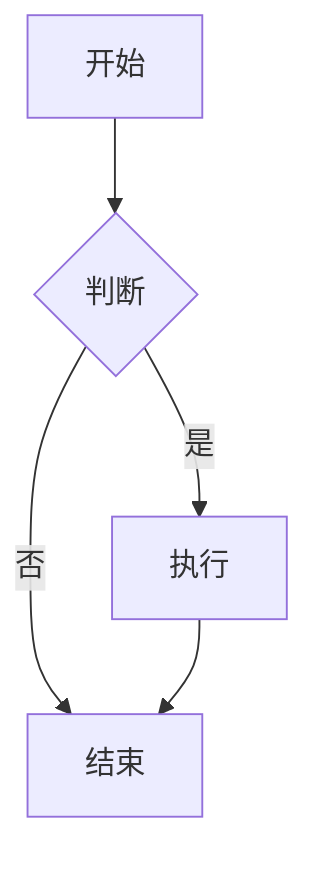

# Markdown 语法指南

## 一、Markdown 简介

Markdown 是一种轻量级标记语言，由 John Gruber 于 2004 年创建。它允许人们使用易读易写的纯文本格式编写文档，然后转换成有效的 HTML。

### 主要特点
- **易读易写**：纯文本格式，学习成本低
- **平台无关**：任何文本编辑器都可使用
- **广泛支持**：GitHub、博客、文档系统等
- **可扩展**：支持表格、代码块、数学公式等

## 二、基础语法

### 1. 标题

Markdown 支持 6 级标题，使用 `#` 表示：

```markdown
# 一级标题
## 二级标题
### 三级标题
#### 四级标题
##### 五级标题
###### 六级标题
```

**效果：**
# 一级标题
## 二级标题
### 三级标题
#### 四级标题
##### 五级标题
###### 六级标题

### 2. 段落与换行

段落由一个或多个连续的文本行组成，段落之间用空行分隔：

```markdown
这是第一段落。
同一段落内的换行不会产生新段落。

这是第二段落，与上一段落之间有空行。  
行末两个空格加换行会产生软换行（<br>）。
```

**效果：**
这是第一段落。
同一段落内的换行不会产生新段落。

这是第二段落，与上一段落之间有空行。  
行末两个空格加换行会产生软换行。

### 3. 强调

```markdown
*斜体文本* 或 _斜体文本_
**粗体文本** 或 __粗体文本__
***粗斜体*** 或 ___粗斜体___
~~删除线文本~~
==高亮文本==（部分编辑器支持）
```

**效果：**
*斜体文本* 或 _斜体文本_
**粗体文本** 或 __粗体文本__
***粗斜体*** 或 ___粗斜体___
~~删除线文本~~
==高亮文本==

### 4. 列表

#### 无序列表
使用 `-`、`*` 或 `+`：

```markdown
- 项目1
- 项目2
  - 子项目2.1
  - 子项目2.2
- 项目3

* 也可以用星号
+ 或者加号
```

**效果：**
- 项目1
- 项目2
  - 子项目2.1
  - 子项目2.2
- 项目3

#### 有序列表
使用数字加英文句点：

```markdown
1. 第一项
2. 第二项
   1. 子项 2.1
   2. 子项 2.2
3. 第三项
```

**效果：**
1. 第一项
2. 第二项
   1. 子项 2.1
   2. 子项 2.2
3. 第三项

#### 任务列表
```markdown
- [x] 已完成任务
- [ ] 未完成任务
- [ ] 另一个任务
```

**效果：**
- [x] 已完成任务
- [ ] 未完成任务
- [ ] 另一个任务

### 5. 链接

#### 行内链接
```markdown
[链接文本](https://example.com)
[带标题的链接](https://example.com "鼠标悬停提示")
```

**效果：**
[链接文本](https://example.com)
[带标题的链接](https://example.com "鼠标悬停提示")

#### 引用链接
```markdown
[链接文本][引用ID]

[引用ID]: https://example.com "可选标题"
```

**效果：**
[GitHub][1]

[1]: https://github.com "GitHub 首页"

#### 自动链接
```markdown
<https://example.com>
<email@example.com>
```

**效果：**
<https://example.com>
<email@example.com>

### 6. 图片

```markdown


带链接的图片：
[](链接URL)
```

**效果：**


### 7. 引用

```markdown
> 这是一级引用
>
> > 这是二级引用
> >
> > > 这是三级引用
>
> 可以包含其他元素：
> - 列表项
> **粗体文本**
```

**效果：**
> 这是一级引用
>
> > 这是二级引用
> >
> > > 这是三级引用
>
> 可以包含其他元素：
> - 列表项
> **粗体文本**

### 8. 代码

#### 行内代码
```markdown
使用 `printf()` 函数输出 `Hello World`
```

**效果：**
使用 `printf()` 函数输出 `Hello World`

#### 代码块
使用三个反引号：

````markdown
```python
def hello_world():
    print("Hello, World!")
    return True
```
````

**效果：**
```python
def hello_world():
    print("Hello, World!")
    return True
```

#### 缩进代码块
```markdown
    每行缩进4个空格或一个制表符
    这也会被渲染为代码块
    但不能指定语言
```

**效果：**
    每行缩进4个空格或一个制表符
    这也会被渲染为代码块
    但不能指定语言

### 9. 水平线

```markdown
---
***
___
```

**效果：**
---
***
___

## 三、扩展语法

### 1. 表格

```markdown
| 左对齐 | 居中对齐 | 右对齐 |
|:-------|:--------:|-------:|
| 单元格1 | 单元格2  | 单元格3 |
| 长文本 | 居中对齐 |    123 |
| 左对齐 | 演示效果 |  右对齐 |
```

**效果：**
| 左对齐  | 居中对齐 |  右对齐 |
| :------ | :------: | ------: |
| 单元格1 | 单元格2  | 单元格3 |
| 长文本  | 居中对齐 |     123 |
| 左对齐  | 演示效果 |  右对齐 |

### 2. 脚注

```markdown
这里需要脚注[^1]来说明。

[^1]: 这是脚注的内容，可以写很长。
也可以跨多行，但第二行需要缩进。
```

**效果：**
这里需要脚注[^1]来说明。

[^1]: 这是脚注的内容，可以写很长。
也可以跨多行，但第二行需要缩进。

### 3. 定义列表

```markdown
Markdown
: 一种轻量级标记语言
: 由 John Gruber 创建

HTML
: 超文本标记语言
: 用于创建网页
```

**效果：**
Markdown
: 一种轻量级标记语言
: 由 John Gruber 创建

HTML
: 超文本标记语言
: 用于创建网页

### 4. 删除线（GFM）

```markdown
~~这是删除线文本~~
~~也可以跨越多行~~
```

**效果：**
~~这是删除线文本~~
~~也可以跨越多行~~

### 5. 表情符号

```markdown
:smile: :heart: :thumbsup: :rocket:
:+1: :-1: :octocat: :shipit:
```

**效果：**
:smile: :heart: :thumbsup: :rocket:
:+1: :-1: :octocat: :shipit:

### 6. 数学公式（KaTeX）

```markdown
行内公式：$E = mc^2$

独立公式：
$$
\frac{-b \pm \sqrt{b^2 - 4ac}}{2a}
$$

$$
\begin{pmatrix}
a & b \\
c & d
\end{pmatrix}
$$
```

**效果：**
行内公式：$E = mc^2$

独立公式：
$$
\frac{-b \pm \sqrt{b^2 - 4ac}}{2a}
$$

$$
\begin{pmatrix}
a & b \\
c & d
\end{pmatrix}
$$

### 7. 图表（Mermaid）

````markdown

````

**效果：**


### 8. 流程图

````markdown
```flow
st=>start: 开始
op=>operation: 处理
cond=>condition: 判断?
e=>end: 结束

st->op->cond
cond(yes)->e
cond(no)->op
```
````

## 四、HTML 混合使用

Markdown 支持直接嵌入 HTML：

```markdown
<div style="color: red; background: yellow; padding: 10px;">
  <h3>这是 HTML 区域</h3>
  <p>可以在 Markdown 中直接使用 HTML 标签</p>
  <ul>
    <li>列表项1</li>
    <li>列表项2</li>
  </ul>
</div>

<details>
<summary>点击展开详情</summary>
这里是隐藏的内容，点击后才显示。
- 可以包含 Markdown **语法**
- 也支持列表
</details>

<kbd>Ctrl</kbd> + <kbd>C</kbd> 复制
```

**效果：**
<div style="color: red; background: yellow; padding: 10px;">
  <h3>这是 HTML 区域</h3>
  <p>可以在 Markdown 中直接使用 HTML 标签</p>
  <ul>
    <li>列表项1</li>
    <li>列表项2</li>
  </ul>
</div>

<details>
<summary>点击展开详情</summary>
这里是隐藏的内容，点击后才显示。
- 可以包含 Markdown **语法**
- 也支持列表
</details>

<kbd>Ctrl</kbd> + <kbd>C</kbd> 复制

## 五、高级技巧

### 1. 锚点链接

```markdown
跳转到 [基础语法](#二基础语法)

使用 HTML 锚点：
<span id="custom-anchor"></span>
跳转到 [自定义锚点](#custom-anchor)
```

**效果：**
跳转到 [基础语法](#二基础语法)

### 2. 转义字符

```markdown
\*不会被解析为强调\*
\_也不会被解析\_
\# 不会被解析为标题
\[不会成为链接\]
```

**效果：**
\*不会被解析为强调\*
\_也不会被解析\_
\# 不会被解析为标题
\[不会成为链接\]

### 3. 注释

```markdown
[comment]: # (这是注释，不会显示)

[//]: # (这也是注释)

<!-- HTML 注释也会被保留，但可以跨多行 -->
```

**效果：**
[comment]: # "这是注释，不会显示"

### 4. 折叠代码块

````markdown
<details>
<summary>点击查看代码</summary>

```python
def hello():
    print("Hello World")
```

</details>
````

**效果：**
<details>
<summary>点击查看代码</summary>

```python
def hello():
    print("Hello World")
```

</details>

### 5. 自定义容器

```markdown
:::tip
这是一条提示信息
:::

:::warning
这是一条警告信息
:::

:::danger
这是一条危险信息
:::
```

**效果：**
:::tip
这是一条提示信息
:::

:::warning
这是一条警告信息
:::

:::danger
这是一条危险信息
:::

## 六、各平台特有语法

### 1. GitHub Flavored Markdown

```markdown
@username 提到用户
#123 引用 Issue
commit_hash 引用提交

- [x] 任务列表

emoji: :sparkles: :bug: :rocket:

表格对齐：
| Left | Center | Right |
|:-----|:------:|------:|
```

### 2. Typora 特有语法

```markdown
- 数学公式：$$ LaTeX $$
- 图表：```mermaid
- 脚注：[^1]
- 目录：[TOC]
- 内部链接：[标题](#标题)
```

### 3. Obsidian 特有语法

```markdown
[[内部链接]]
![[嵌入其他笔记]]
#标签
^块引用

---
markmap
  - 思维导图
  - 节点1
    - 子节点
```

## 七、最佳实践

### 1. 文档结构规范

```markdown
# 文档标题

## 目录
[TOC]

## 简介
简要介绍文档内容...

## 章节一
### 小节1.1
### 小节1.2

## 章节二
### 小节2.1
### 小节2.2

## 常见问题
### Q1: 问题描述
### Q2: 问题描述

## 参考资料
- [链接1](url)
- [链接2](url)
```

### 2. 排版规范

- **中英文之间加空格**：使用 `Markdown 语法` 而不是 `Markdown语法`
- **中文与数字之间加空格**：`版本 2.0` 而不是 `版本2.0`
- **使用全角标点**：中文内容使用全角标点（，。！？）
- **代码块指定语言**：```python 而不是 ```
- **表格使用对齐标记**：提高可读性

### 3. 图片管理

```markdown


<!-- 使用相对路径 -->


<!-- 使用 CDN -->

```

### 4. 链接管理

```markdown
<!-- 使用引用链接统一管理 -->
所有参考资料都在文档末尾定义。

[官方网站][site]
[文档中心][docs]

[site]: https://example.com "官网"
[docs]: https://docs.example.com "文档"
```

## 八、编辑器推荐

### 1. Typora（推荐）
- **特点**：所见即所得，简洁美观
- **平台**：Windows/macOS/Linux
- **价格**：Beta 版免费，正式版收费

### 2. VS Code + 插件
- **插件**：
  - Markdown All in One
  - Markdown Preview Enhanced
  - Paste Image
  - Markdownlint

### 3. Obsidian
- **特点**：双向链接，知识库管理
- **平台**：全平台
- **价格**：个人免费

### 4. 在线编辑器
- **StackEdit**：功能强大，支持同步
- **HackMD**：协作编辑，支持实时预览
- **Dillinger**：简洁易用

## 九、常见问题解决

### 1. 换行不生效
```markdown
问题：两个段落之间没有空行
解决：确保段落之间有空行

问题：同一段落内换行
解决：行末加两个空格再换行
```

### 2. 列表显示不正常
```markdown
问题：列表后的文本被当作列表项
解决：列表后加空行再写正文

问题：嵌套列表不缩进
解决：子列表缩进 2-4 个空格
```

### 3. 表格错乱
```markdown
问题：表格列不对齐
解决：使用等宽字体编辑，确保 | 对齐

问题：单元格内有竖线 |
解决：使用 HTML 实体 &#124; 代替
```

## 十、转换工具

### Pandoc（万能转换器）
```bash
# Markdown 转 HTML
pandoc input.md -o output.html

# Markdown 转 PDF
pandoc input.md -o output.pdf

# Markdown 转 Word
pandoc input.md -o output.docx

# Markdown 转 EPUB
pandoc input.md -o output.epub
```

### 其他工具
- **mdpdf**：Markdown 转 PDF
- **markdown-pdf**：Node.js 转换工具
- **Typora**：支持导出多种格式

## 十一、语法速查表

| 元素   | 语法          | 示例         |
| ------ | ------------- | ------------ |
| 标题   | `# H1`        | # 一级标题   |
| 粗体   | `**text**`    | **粗体**     |
| 斜体   | `*text*`      | *斜体*       |
| 链接   | `[text](url)` | [示例](url)  |
| 图片   | `` |  |
| 代码   | `` `code` ``  | `code`       |
| 列表   | `- item`      | - 项目       |
| 引用   | `> quote`     | > 引用       |
| 表格   | `\|--\|--\|`  | 见上表       |
| 分割线 | `---`         | ---          |
| 删除线 | `~~text~~`    | ~~text~~     |
| 脚注   | `[^1]`        | [^1]         |
| 任务   | `- [ ]`       | - [ ]        |

## 十二、学习资源

- [Markdown 官方文档](https://daringfireball.net/projects/markdown/)
- [GitHub Flavored Markdown](https://github.github.com/gfm/)
- [CommonMark 规范](https://commonmark.org/)
- [Markdown 教程](https://www.markdownguide.org/)
- [Typora 支持文档](https://support.typora.io/)

